# OpenSeer — Distributed HTTP Monitoring

Self-hosted, horizontally scalable HTTP monitoring with a modern web interface. Multi-user support with secure authentication, real-time dashboards, and comprehensive monitoring management. Built with Go backend and Next.js frontend.

## Architecture

```mermaid
graph TB
    Users[👥 Users]
    WebUI[🌐 Web UI<br/>Next.js :3000]
    ControlPlane[🎯 Control Plane<br/>Go :8081/:8082]
    Workers[⚡ Workers<br/>Go - Distributed]
    Database[(🗄️ TimescaleDB<br/>PostgreSQL)]

    Users --> WebUI
    WebUI -.->|Session Auth<br/>Connect RPC| ControlPlane
    Workers <-.->|mTLS gRPC<br/>Bidirectional Stream| ControlPlane
    ControlPlane --> Database

    subgraph "Database Schemas"
        AppSchema[📋 app schema<br/>monitors, jobs, workers, users]
        TSSchema[📊 ts schema<br/>results_raw, results_agg_*]
    end

    Database --- AppSchema
    Database --- TSSchema
```



OpenSeer consists of four main components:

- **Web Frontend (Next.js)** - Modern dashboard with real-time metrics visualization, multi-user support with secure session-based authentication
- **Control Plane (Go)** - Service managing workers and job scheduling
- **Workers (Go)** - Distributed agents executing HTTP checks across geographic regions, communicating via mTLS gRPC
- **Database (PostgreSQL + TimescaleDB)** - Time-series storage with automatic aggregation (1-minute, 1-hour, and 1-day intervals), P50/P95/P99 latency tracking, and uptime statistics

### Key Design Principles

- **Pull-based scheduling** - Workers request jobs when ready
- **Exactly-once execution** - Database-backed leases with row locking ensure no duplicate work
- **Multi-region distribution** - Workers can be deployed across geographic regions
- **Secure by default** - mTLS for worker communication, session auth for users
- **Horizontally scalable** - Add workers and control plane replicas as needed

For detailed architecture documentation, see:
- [Control Plane Architecture](cmd/control-plane/ARCHITECTURE.md)
- [Worker Architecture](cmd/worker/ARCHITECTURE.md)

## Quick Start

Start the complete stack with one command:

```bash
task up
```

Then access:
- **Web UI**: http://localhost:3000
- **API**: https://localhost:8082

### Step-by-Step Setup

1. **Start Database**
   ```bash
   task db-up       # PostgreSQL + TimescaleDB
   task migrate-up  # Database migrations
   ```

2. **Start Services**
   ```bash
   task backend-up  # Control plane + workers
   task web-up      # Web interface
   ```

3. **Create Monitors**
   - Open http://localhost:3000
   - Sign up/sign in
   - Add monitors via the web interface

### Development Mode

For development with hot-reload:

```bash
task dev-full    # Full stack with live reload
```

### Common Commands

```bash
task logs              # View all service logs
task scale-workers N=3 # Scale workers
task psql              # Database CLI
task build             # Build images
task --list            # Show all available tasks
```

## Contributing

Contributions are welcome! Please see the detailed architecture documentation in the `cmd/` directories for implementation details.

## License

MIT
