# OpenSeer — Distributed HTTP Monitoring

Self-hosted, horizontally scalable HTTP monitoring with a modern web interface. Multi-user support with secure authentication, real-time dashboards, and comprehensive monitoring management. Built with Go backend and Next.js frontend.

## Features

- **Web Dashboard** - Full-featured UI for monitor management and metrics visualization
- **Multi-user Support** - Secure authentication with session management
- **Real-time Metrics** - Live monitoring with P50/P95/P99 latency tracking and uptime statistics
- **Multi-region Monitoring** - Distributed workers across geographic regions
- **Secure Architecture** - mTLS for worker communication, session-based auth for users
- **Time-series Analytics** - TimescaleDB with 1-minute, 1-hour, and 1-day aggregations

## Architecture

```mermaid
graph TB
    Users[👥 Users]
    WebUI[🌐 Web UI<br/>Next.js :3000]
    ControlPlane[🎯 Control Plane<br/>Go :8081/:8082]
    Workers[⚡ Workers<br/>Go - Distributed]
    Database[(🗄️ TimescaleDB<br/>PostgreSQL)]

    Users --> WebUI
    WebUI -.->|Session Auth<br/>Connect RPC| ControlPlane
    Workers <-.->|mTLS gRPC<br/>Bidirectional Stream| ControlPlane
    ControlPlane --> Database

    subgraph "Database Schemas"
        AppSchema[📋 app schema<br/>monitors, jobs, workers, users]
        TSSchema[📊 ts schema<br/>results_raw, results_agg_*]
    end

    Database --- AppSchema
    Database --- TSSchema
```



OpenSeer consists of three main components:

- **Web Frontend (Next.js)** - Modern dashboard with real-time metrics visualization
- **Control Plane (Go)** - Horizontally scalable service managing workers and job scheduling
- **Workers (Go)** - Distributed agents executing HTTP checks across geographic regions
- **Database (PostgreSQL + TimescaleDB)** - Time-series storage with automatic aggregation

For detailed architecture documentation, see:
- [Control Plane Architecture](cmd/control-plane/ARCHITECTURE.md)
- [Worker Architecture](cmd/worker/ARCHITECTURE.md)

## Quick Start

Start the complete stack with one command:

```bash
make up
```

Then access:
- **Web UI**: http://localhost:3000
- **API**: https://localhost:8082

### Step-by-Step Setup

1. **Start Database**
   ```bash
   make db-up       # PostgreSQL + TimescaleDB
   make migrate-up  # Database migrations
   ```

2. **Start Services**
   ```bash
   make backend-up  # Control plane + workers
   make web-up      # Web interface
   ```

3. **Create Monitors**
   - Open http://localhost:3000
   - Sign up/sign in
   - Add monitors via the web interface

### Development Mode

For development with hot-reload:

```bash
make dev-full    # Full stack with live reload
```

### Common Commands

```bash
make logs              # View all service logs
make scale-workers N=3 # Scale workers
make psql             # Database CLI
make build            # Build images
```

## Key Design Principles

- **Pull-based scheduling** - Workers request jobs when ready, eliminating race conditions
- **Exactly-once execution** - Database-backed leases with row locking ensure no duplicate work
- **Multi-region distribution** - Workers can be deployed across geographic regions
- **Secure by default** - mTLS for worker communication, session auth for users
- **Horizontally scalable** - Add workers and control plane replicas as needed

## Contributing

Contributions are welcome! Please see the detailed architecture documentation in the `cmd/` directories for implementation details.

## License

[License information to be added]
