# OpenSeer — Distributed HTTP Monitoring

Self-hosted, horizontally scalable HTTP monitoring with a modern web interface. Multi-user support with secure authentication, real-time dashboards, and comprehensive monitoring management. Built with Go backend and TanStack Start frontend.

## Architecture

```mermaid
graph TB
    Users[👥 Users]
    WebUI[🌐 Web UI<br/>TanStack Start :3000]
    ControlPlane[🎯 Control Plane<br/>Go :8081/:8082]
    Database[(🗄️ TimescaleDB<br/>PostgreSQL)]

    subgraph "Workers - Distributed"
        WorkerUS[⚡ Worker US-East<br/>Go - us-east-1]
        WorkerEU[⚡ Worker EU-West<br/>Go - eu-west-1]
        WorkerAP[⚡ Worker AP-South<br/>Go - ap-south-1]
    end

    Users --> WebUI
    WebUI -.->|Session Auth<br/>Connect RPC| ControlPlane
    WorkerUS <-.->|mTLS gRPC<br/>Bidirectional Stream| ControlPlane
    WorkerEU <-.->|mTLS gRPC<br/>Bidirectional Stream| ControlPlane
    WorkerAP <-.->|mTLS gRPC<br/>Bidirectional Stream| ControlPlane
    ControlPlane --> Database

    subgraph "Database Schemas"
        AppSchema[📋 app schema<br/>monitors, jobs, workers, users]
        TSSchema[📊 ts schema<br/>results_raw, results_agg_*]
    end

    Database --- AppSchema
    Database --- TSSchema
```



OpenSeer consists of four main components:

- **Web Frontend (TanStack Start)** - Modern dashboard with real-time metrics visualization, multi-user support with secure session-based authentication
- **Control Plane (Go)** - Service managing workers and job scheduling
- **Workers (Go)** - Distributed agents executing HTTP checks across geographic regions, communicating via mTLS gRPC
- **Database (PostgreSQL + TimescaleDB)** - Time-series storage with automatic aggregation (1-minute, 1-hour, and 1-day intervals), P50/P95/P99 latency tracking, and uptime statistics

For detailed architecture documentation, see:
- [Control Plane Architecture](cmd/control-plane/ARCHITECTURE.md)
- [Worker Architecture](cmd/worker/ARCHITECTURE.md)

## Quick Start

Use the Taskfile to prepare the database and bring everything up:

```bash
task migrate  # Runs auth + backend migrations sequentially
task up       # Starts TimescaleDB, control-plane, worker, and web services
```

Then access:
- **Web UI**: http://localhost:3000
- **API**: https://localhost:8082

### Operational Commands

- `task migrate` — Ensures TimescaleDB is healthy, runs auth migrations, then backend migrations.
- `task up` — Brings every service up via Docker Compose (app profile) and waits for health checks.
- `task down` — Stops the stack and removes stray containers.
- `task clean` — Stops the stack and deletes associated volumes for a fresh start.

After the stack is running, open http://localhost:3000, sign in, and manage monitors through the web UI.

## Contributing

Contributions are welcome! Please see the detailed architecture documentation in the `cmd/` directories for implementation details.

## License

MIT
