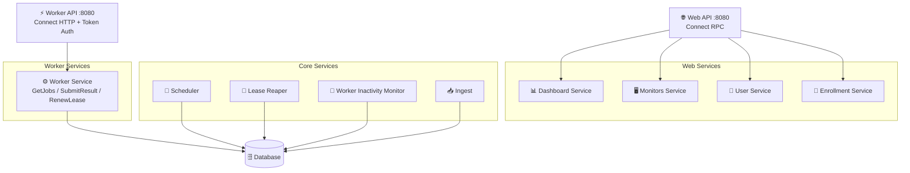

# Control Plane Architecture

The Control Plane is a horizontally scalable Go service that orchestrates HTTP monitoring across distributed workers.

## Overview



## Single API Architecture

### Worker API (`:8080`)
- **Protocol**: Connect RPC over HTTP
- **Authentication**: Bearer token (`Authorization: Bearer ostk_...`)
- **Purpose**: Job distribution and result collection via polling
- **Endpoints**: `GetJobs`, `SubmitResult`, `RenewLease`

### Web API (`:8080`)
- **Protocol**: Connect RPC over HTTP
- **Authentication**: Session-based (cookies)
- **Purpose**: Frontend integration and worker enrollment
- **Services**: Dashboard data, monitor CRUD, user management, enrollment

## Core Services

### Scheduler
**Purpose**: Creates jobs from monitor configurations

- Polls every 1 second with ~5 second look-ahead
- Uses PostgreSQL advisory locks for leader election
- Tracks cadence with `next_due_at` to prevent duplicates
- Implements adaptive jitter:
  - No jitter for intervals ≤10s (precision monitoring)
  - 1% jitter for 10s-30s intervals
  - 10% jitter for >30s intervals (thundering herd protection)

### Worker Service
**Purpose**: Handles worker job polling and result submission

- **Pull-based model**: Workers poll `GetJobs` when ready for work
- **Database-backed leases**: Uses `FOR UPDATE SKIP LOCKED`
- **Lease management**: Configurable timeout with renewal support
- **Region awareness**: Routes jobs to worker region; falls back to `global` jobs
- **Result handling**: Commits results to database before acknowledging

### Lease Reaper
**Purpose**: Reclaims expired job leases

- Runs every 5 seconds using leader election
- Returns expired `leased` jobs to `ready` state
- Enables rapid failure recovery from crashed workers
- Uses advisory locks to prevent duplicate reaping

### Worker Inactivity Monitor
**Purpose**: Maintains worker registry health

- Monitors worker heartbeats via `last_seen_at` timestamps
- Marks workers as inactive based on configurable thresholds
- Updates worker status for dashboard visibility
- Coordinates with lease reaper for job reassignment

### Ingest
**Purpose**: Persists monitoring results

- Writes to TimescaleDB `ts.results_raw` hypertable
- Uses UPSERT by `(run_id, event_at)` for idempotency
- Enables safe retries when jobs are re-executed
- Triggers continuous aggregate updates

## Web Services

### Dashboard Service
- Aggregated metrics from continuous aggregates
- Monitor health overview and recent failures
- Real-time uptime statistics and latency percentiles
- Regional performance breakdown

### Monitors Service
- CRUD operations for monitor configurations
- Soft delete support with audit trails
- Validation of URLs, intervals, and assertions
- Region targeting and scheduling metadata

### User Service
- User profile and session management
- Integration with Better Auth for authentication
- Session-based API authentication
- Account lifecycle management

### Enrollment Service
- Worker registration with cluster token validation
- API token generation and distribution (`ostk_...` format)
- Token renewal and revocation support
- Worker capability registration

## Correctness Guarantees

### Exactly-Once Job Assignment
1. **Database-level row locking** with `FOR UPDATE SKIP LOCKED`
2. **Job state machine**: `ready → leased → done`
3. **Worker ID enforcement** in all lease operations
4. **Automatic lease expiry** returns jobs to ready state

### Scheduling Precision
- **Pre-scheduled jobs**: 5s look-ahead prevents delays
- **High-frequency polling**: 1s scheduler cycle
- **Per-check cadence tracking**: Prevents duplicate scheduling
- **Leader election**: Only one scheduler creates jobs

### Result Durability
- **Commit before ACK**: Only acknowledge durable writes
- **Idempotent ingest**: UPSERT by `(run_id, event_at)` allows retries
- **Lease expiry fallback**: Handles worker failures gracefully

## Data Model

### Application Schema (`app`)

**monitors**
```sql
- id, name, user_id, url, method, interval_ms, timeout_ms
- headers (JSON), assertions (JSON), regions (array)
- last_scheduled_at, next_due_at, enabled, deleted_at
- jitter_seed (deterministic randomization)
```

**jobs**
```sql
- run_id (PK), monitor_id, region, status, scheduled_at
- lease_expires_at, worker_id, deleted_at
- States: ready → leased → done
```

**workers**
```sql
- id, hostname, region, version, status
- registered_at, enrolled_at, last_seen_at, token_hash
- revoked_at, revoked_reason
```

### Time-series Schema (`ts`)

**results_raw** (Hypertable)
```sql
- Partitioned by event_at (1-day chunks)
- Request/response timings, HTTP status, payload size
- Error messages and regional attribution
- UPSERT by run_id for idempotency
```

**results_agg_1m/1h/1d** (Continuous Aggregates)
```sql
- Pre-calculated: count, error_rate, p50/p95/p99
- Uptime percentages and success/failure counts
- Automatic refresh with configurable lag
```

## Scalability

### Horizontal Scaling
- **Stateless design**: All state in database
- **Leader election**: Advisory locks coordinate replicas
- **Load balancing**: Multiple control plane instances
- **Database connection pooling**: Shared connection management

## Security

### Token Authentication for Workers
- Bearer token authentication (`Authorization: Bearer ostk_...`)
- Token hash stored in database for validation
- Secure token generation with cryptographic randomness
- Token renewal and revocation support

### Session Authentication for Web
- Cookie-based sessions
- CSRF protection
- Secure session storage
- Token format: `tokenId.signature` (HMAC-SHA256 over tokenId with `BETTER_AUTH_SECRET`)
- Session lookup against `web/migrations/auth/schema.sql` tables (`session`, `user`)

For multi-cloud hardening guidance, see `docs/production-multicloud.md`.
