# Worker Architecture

Workers are distributed Go agents that execute HTTP monitoring checks across geographic regions. They maintain persistent connections to the Control Plane and operate using a pull-based job model.

## Overview

```mermaid
graph TB
    ControlPlane[🎯 Control Plane<br/>:8081 gRPC + mTLS]

    subgraph "Worker Process"
        Connection[🔗 Connection Manager]
        JobExecutor[⚡ Job Executor]
        HTTPClient[🌐 HTTP Client]
        Certificate[🔐 Certificate Manager]
        Heartbeat[💓 Heartbeat Manager]
    end

    subgraph "Job Flow"
        RequestJobs[📋 Request Jobs]
        ExecuteCheck[🔍 Execute HTTP Check]
        StreamResult[📤 Stream Result]
        RenewLease[🔄 Renew Lease]
    end

    subgraph "Target Endpoints"
        Website1[🌍 Website 1]
        Website2[🌍 Website 2]
        API1[🔌 API Endpoint 1]
        API2[🔌 API Endpoint 2]
    end

    ControlPlane <-.->|Bidirectional<br/>gRPC Stream| Connection

    Connection --> JobExecutor
    JobExecutor --> HTTPClient
    Certificate -.-> Connection
    Heartbeat -.-> Connection

    RequestJobs --> ExecuteCheck
    ExecuteCheck --> StreamResult
    StreamResult --> RenewLease
    RenewLease --> RequestJobs

    HTTPClient --> Website1
    HTTPClient --> Website2
    HTTPClient --> API1
    HTTPClient --> API2
```



## Core Components

### Connection Manager
**Purpose**: Maintains persistent gRPC connection to Control Plane

- **Outbound-only connections**: Workers initiate all connections
- **mTLS authentication**: Uses enrolled client certificates
- **Exponential backoff**: Reconnection strategy for network failures
- **Stream health**: Responds to ping/pong heartbeats
- **Graceful shutdown**: Completes in-flight work before exit

**Connection Flow**:
1. Load mTLS certificate from secure storage
2. Establish gRPC stream to Control Plane
3. Send RegisterRequest with worker metadata
4. Maintain bidirectional message flow
5. Handle connection failures with backoff

### Job Executor
**Purpose**: Orchestrates HTTP check execution and lifecycle

- **Pull-based requests**: Explicitly requests jobs when ready
- **Concurrency control**: Configurable max parallel jobs
- **Lease management**: Automatic renewal for long-running checks
- **Result streaming**: Best-effort delivery with fallback to lease expiry
- **Timeout handling**: Respects per-check timeout configurations

**Execution Flow**:
1. Request N jobs when capacity available
2. Receive CheckJob assignments from Control Plane
3. Execute HTTP checks concurrently
4. Stream results back immediately
5. Renew leases for checks >20 seconds
6. Request new jobs after completion

### HTTP Client
**Purpose**: Executes actual HTTP monitoring checks

- **Custom headers**: Supports arbitrary request headers
- **Method support**: GET, POST, PUT, DELETE, HEAD, OPTIONS
- **Timeout enforcement**: Per-check timeout with context cancellation
- **Response capture**: Status code, timing, payload size, headers
- **Error handling**: Network errors, DNS failures, timeouts
- **TLS verification**: Configurable certificate validation

**Check Execution**:
```go
type CheckResult struct {
    RunID           string
    Status          string  // "OK", "ERROR", "TIMEOUT"
    HTTPStatusCode  int
    ResponseTimeMS  int64
    DNSTimeMS       int64
    ConnectTimeMS   int64
    TLSTimeMS       int64
    ResponseBytes   int64
    ErrorMessage    string
    Region          string
}
```

### Certificate Manager
**Purpose**: Handles mTLS certificate lifecycle

- **Enrollment flow**: Initial certificate request using cluster token
- **Secure storage**: Certificates stored with proper file permissions
- **Auto-renewal**: Proactive certificate refresh before expiry
- **CA validation**: Verifies Control Plane certificates
- **Bootstrap security**: HTTPS enrollment with bundled CA

**Certificate Locations**:
- **User mode**: `~/.openseer/worker-cert.pem`, `~/.openseer/worker-key.pem`
- **System mode**: `/var/lib/openseer/worker-cert.pem`, `/var/lib/openseer/worker-key.pem`
- **CA bundle**: `ENROLLMENT_CA_FILE` environment variable

### Heartbeat Manager
**Purpose**: Maintains connection health and worker status

- **Ping/Pong protocol**: Responds to Control Plane health checks
- **Stream monitoring**: Detects connection failures
- **Status reporting**: Periodic worker status updates
- **Region reporting**: Geographic location for job routing

## Protocol Implementation

### Bidirectional gRPC Messages

**Worker → Control Plane**:
```protobuf
message RegisterRequest {
    string worker_version = 1;
    string region = 2;
}

message JobRequest {
    int32 count = 1;
}

message CheckResult {
    string run_id = 1;
    string status = 2;
    int64 response_time_ms = 3;
    int32 http_status_code = 4;
    string error_message = 5;
    // ... timing details
}

message LeaseRenewal {
    string run_id = 1;
}

message Pong {
    int64 timestamp = 1;
}
```

**Control Plane → Worker**:
```protobuf
message RegisterResponse {
    string worker_id = 1;
    bool accepted = 2;
    string rejection_reason = 3;
}

message CheckJob {
    string run_id = 1;
    string monitor_id = 2;
    string url = 3;
    int32 timeout_ms = 4;
    string method = 5;
    map<string, string> headers = 6;
}

message ResultAck {
    string run_id = 1;
    bool committed = 2;
}

message Ping {
    int64 timestamp = 1;
}
```

## Deployment Patterns

### Single Region
```bash
# Example (envs) connecting to control plane at :8081 and enrolling via :8082
REGION=us-east-1 CONTROL_PLANE_ADDR=cp.example.com:8081 ENROLLMENT_PORT=8082 CLUSTER_TOKEN=... ./worker
```

### Multi-Region Distribution
```yaml
# docker-compose.yml
version: '3.8'
services:
  worker-us-east:
    image: openseer/worker
    environment:
      - REGION=us-east-1
      - CONTROL_PLANE_URL=https://cp.example.com:8081

  worker-eu-west:
    image: openseer/worker
    environment:
      - REGION=eu-west-1
      - CONTROL_PLANE_URL=https://cp.example.com:8081

  worker-ap-south:
    image: openseer/worker
    environment:
      - REGION=ap-south-1
      - CONTROL_PLANE_URL=https://cp.example.com:8081
```

### Kubernetes Deployment
```yaml
apiVersion: apps/v1
kind: Deployment
metadata:
  name: openseer-worker
spec:
  replicas: 3
  selector:
    matchLabels:
      app: openseer-worker
  template:
    metadata:
      labels:
        app: openseer-worker
    spec:
      containers:
      - name: worker
        image: openseer/worker:latest
        env:
        - name: REGION
          value: "us-west-2"
        - name: CONTROL_PLANE_URL
          value: "https://openseer-cp:8081"
        - name: ENROLLMENT_CA_FILE
          value: "/etc/openseer/ca.pem"
        volumeMounts:
        - name: ca-cert
          mountPath: /etc/openseer
          readOnly: true
      volumes:
      - name: ca-cert
        secret:
          secretName: openseer-ca
```

## Configuration

### Environment Variables
```bash
# Connection
CONTROL_PLANE_ADDR=localhost:8081
ENROLLMENT_PORT=8082
ENROLLMENT_CA_FILE=/path/to/ca.pem
CLUSTER_TOKEN=your-cluster-token

# Worker Identity
REGION=us-east-1
WORKER_ID=worker-01

# Performance
MAX_CONCURRENCY=10
```

### Notes
- Enrollment is performed against the Web API on `ENROLLMENT_PORT` (default 8082).
- Worker stream uses mTLS to the Worker API on `CONTROL_PLANE_ADDR` (default :8081).

## Security Model

### Enrollment Process
1. **Bootstrap**: Worker starts with cluster token and CA bundle
2. **HTTPS enrollment**: Connects to Control Plane enrollment endpoint
3. **Token validation**: Control Plane verifies cluster token
4. **Certificate issuance**: Worker receives mTLS client certificate
5. **Secure storage**: Certificate saved with restricted permissions
6. **mTLS connection**: Subsequent connections use client certificate

### Certificate Security
- **File permissions**: 0600 for private keys, 0644 for certificates
- **Secure directories**: Platform-appropriate data directories
- **Expiry monitoring**: Automatic renewal before expiration
- **Revocation support**: Certificate can be revoked remotely

### Network Security
- **mTLS mutual authentication**: Both client and server verify certificates
- **Outbound-only connections**: Workers never accept inbound connections
- **Certificate pinning**: Workers validate Control Plane certificate
- **Secure enrollment**: Bootstrap uses HTTPS with CA validation

## Reliability Features

### Connection Resilience
- **Exponential backoff**: 1s, 2s, 4s, 8s, ... up to 5 minutes
- **Connection pooling**: Persistent connection reuse
- **Stream recovery**: Automatic reconnection on failures
- **Graceful shutdown**: SIGTERM handling with job completion

### Job Processing
- **Best-effort delivery**: Stream results immediately when possible
- **Lease-based recovery**: Jobs automatically reassigned on failure
- **Timeout handling**: Context cancellation for stuck operations
- **Resource limits**: Memory and CPU bounds per job