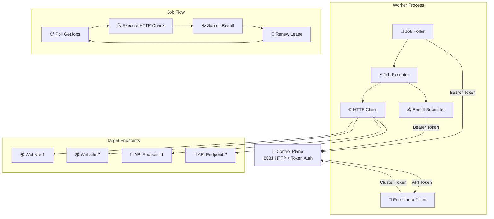

# Worker Architecture

Workers are distributed Go agents that execute HTTP monitoring checks across geographic regions. They communicate with the Control Plane using a simple HTTP polling model with bearer token authentication.

## Overview



## Core Components

### Enrollment Client
**Purpose**: Handles initial worker registration

- **Cluster token validation**: Uses shared cluster token for enrollment
- **API token retrieval**: Receives bearer token (`ostk_...`) for subsequent requests
- **Region registration**: Declares worker's geographic region
- **Automatic renewal**: Supports token renewal before expiry

**Enrollment Flow**:
1. Connect to enrollment endpoint with cluster token
2. Send worker metadata (hostname, version, region)
3. Receive API token and worker ID
4. Store token for subsequent API calls

### Job Poller
**Purpose**: Fetches available jobs from Control Plane

- **Pull-based model**: Worker requests jobs when capacity available
- **Configurable polling interval**: Default 1 second
- **Concurrency awareness**: Requests only as many jobs as can be processed
- **Region filtering**: Only receives jobs matching worker's region or `global`

**Polling Loop**:
```
while running:
    available_slots = max_concurrency - active_jobs
    if available_slots > 0:
        jobs = GetJobs(max_jobs: available_slots)
        for job in jobs:
            spawn execute_job(job)
    sleep(poll_interval)
```

### Job Executor
**Purpose**: Orchestrates HTTP check execution and lifecycle

- **Concurrent execution**: Configurable max parallel jobs
- **Lease management**: Automatic renewal for long-running checks (>20s timeout)
- **Timeout handling**: Respects per-check timeout configurations
- **Error capture**: Comprehensive error handling and reporting

**Execution Flow**:
1. Create job context with timeout
2. Register job in active jobs map
3. Start lease renewal goroutine (if timeout >20s)
4. Execute HTTP check
5. Submit result to Control Plane
6. Clean up job state

### HTTP Client
**Purpose**: Executes actual HTTP monitoring checks

- **Method support**: GET, POST, PUT, DELETE, HEAD, OPTIONS, PATCH
- **Custom headers**: Supports arbitrary request headers from monitor config
- **Timeout enforcement**: Per-check timeout with context cancellation
- **Timing capture**: DNS, connect, TLS, TTFB, download timings
- **Response capture**: Status code, payload size, headers
- **Error handling**: Network errors, DNS failures, timeouts

**Check Result**:
```go
type MonitorResult struct {
    RunID        string
    MonitorID    string
    Region       string
    Status       string  // "OK", "ERROR", "FAIL"
    HTTPCode     int32
    TotalMs      int32
    DNSMs        int32
    ConnectMs    int32
    TLSMs        int32
    TTFBMs       int32
    DownloadMs   int32
    SizeBytes    int64
    ErrorMessage string
}
```

### Result Submitter
**Purpose**: Sends check results back to Control Plane

- **Immediate submission**: Results sent as soon as check completes
- **Retry logic**: Automatic retry on temporary failures
- **Acknowledgment handling**: Waits for commit confirmation
- **Job cleanup**: Removes job from active map after successful submission

## Protocol Implementation

### Worker API Endpoints

**GetJobs** - Poll for available work
```protobuf
message GetJobsRequest {
    int32 max_jobs = 1;
}

message GetJobsResponse {
    repeated MonitorJob jobs = 1;
}
```

**SubmitResult** - Send check results
```protobuf
message SubmitResultRequest {
    MonitorResult result = 1;
}

message SubmitResultResponse {
    bool committed = 1;
    string run_id = 2;
}
```

**RenewLease** - Extend job lease
```protobuf
message RenewLeaseRequest {
    string run_id = 1;
}

message RenewLeaseResponse {
    bool renewed = 1;
}
```

### Job Message
```protobuf
message MonitorJob {
    string run_id = 1;
    string monitor_id = 2;
    string url = 3;
    int32 timeout_ms = 4;
    string method = 5;
    map<string, string> headers = 6;
}
```

## Deployment Patterns

### Single Worker
```bash
REGION=us-east-1 \
ENROLLMENT_URL=https://cp.example.com:8082 \
CLUSTER_TOKEN=your-cluster-token \
MAX_CONCURRENCY=10 \
./worker
```

### Multi-Region Distribution
```yaml
version: '3.8'
services:
  worker-us-east:
    image: openseer/worker
    environment:
      - REGION=us-east-1
      - ENROLLMENT_URL=https://cp.example.com:8082
      - CLUSTER_TOKEN=${CLUSTER_TOKEN}
      - MAX_CONCURRENCY=10

  worker-eu-west:
    image: openseer/worker
    environment:
      - REGION=eu-west-1
      - ENROLLMENT_URL=https://cp.example.com:8082
      - CLUSTER_TOKEN=${CLUSTER_TOKEN}
      - MAX_CONCURRENCY=10

  worker-ap-south:
    image: openseer/worker
    environment:
      - REGION=ap-south-1
      - ENROLLMENT_URL=https://cp.example.com:8082
      - CLUSTER_TOKEN=${CLUSTER_TOKEN}
      - MAX_CONCURRENCY=10
```

### Kubernetes Deployment
```yaml
apiVersion: apps/v1
kind: Deployment
metadata:
  name: openseer-worker
spec:
  replicas: 3
  selector:
    matchLabels:
      app: openseer-worker
  template:
    metadata:
      labels:
        app: openseer-worker
    spec:
      containers:
      - name: worker
        image: openseer/worker:latest
        env:
        - name: REGION
          value: "us-west-2"
        - name: ENROLLMENT_URL
          value: "https://openseer-cp:8082"
        - name: CLUSTER_TOKEN
          valueFrom:
            secretKeyRef:
              name: openseer-secrets
              key: cluster-token
        - name: MAX_CONCURRENCY
          value: "10"
```

## Configuration

### Environment Variables
```bash
ENROLLMENT_URL=https://localhost:8082
CLUSTER_TOKEN=your-cluster-token
REGION=us-east-1
MAX_CONCURRENCY=10
```

| Variable | Description | Default |
|----------|-------------|---------|
| `ENROLLMENT_URL` | URL of enrollment endpoint | Required |
| `CLUSTER_TOKEN` | Shared cluster enrollment token | Required |
| `REGION` | Geographic region identifier | Required |
| `MAX_CONCURRENCY` | Maximum parallel job execution | `10` |

## Security Model

### Enrollment Process
1. **Bootstrap**: Worker starts with cluster token
2. **HTTPS enrollment**: Connects to Control Plane enrollment endpoint
3. **Token validation**: Control Plane verifies cluster token
4. **API token issuance**: Worker receives bearer token (`ostk_...`)
5. **Token storage**: Token kept in memory for API calls
6. **Authenticated requests**: All Worker API calls include bearer token

### Token Security
- **Secure generation**: Cryptographically random tokens
- **Hash storage**: Only token hash stored server-side
- **Revocation support**: Tokens can be revoked remotely
- **No file storage**: Tokens kept in memory only

### Network Security
- **HTTPS**: All communication over TLS
- **Outbound-only**: Workers never accept inbound connections
- **Token authentication**: Bearer token in Authorization header

## Reliability Features

### Connection Resilience
- **Automatic retry**: Exponential backoff on failures
- **Polling model**: No persistent connections to maintain
- **Stateless design**: Easy recovery from crashes
- **Graceful shutdown**: SIGTERM handling with job completion

### Job Processing
- **Lease-based recovery**: Jobs automatically reassigned on failure
- **Timeout handling**: Context cancellation for stuck operations
- **Resource limits**: Memory and CPU bounds per job
- **Concurrent execution**: Parallel job processing with limits

### Lease Renewal
- **Long-running jobs**: Automatic lease renewal for jobs >20s
- **10-second interval**: Renewal requests every 10 seconds
- **Failure handling**: Job continues if renewal fails
- **Context cancellation**: Renewal stops when job completes
